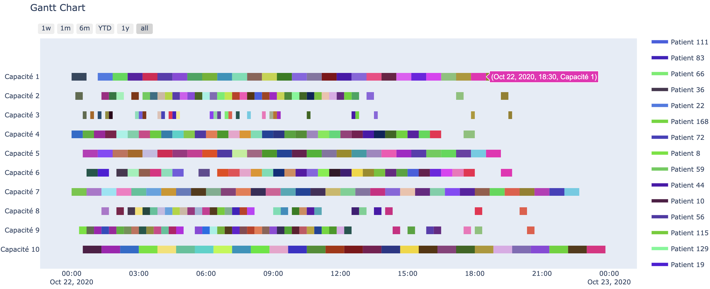

# Scheduling Patients in Emergency Department using Heuristics

### Context of the project

Patient scheduling issues in the Emergency Department (ED) can occur at various levels: upstream, intra or downstream. The goal of scheduling is to organize the Emergency Department better. However, care must be taken when using the term "improve". If we want to reduce waiting time, "improving" means making operations faster. 

Let's take the example of a surgical procedure. Scheduling will probably make the surgeon work longer and the caregivers work less, whereas, in practice, the caregivers are there to reduce the surgeon's intervention time as much as possible. They are necessary and their absence would greatly slow down the progress of e medical task and could even lead to complications. Therefore, we must be precise about the use of scheduling in the ED. The solution we present in this project aims to optimize unnecessary waiting time without risking endangering patients by not making decisions on the allocation of medical staff.

In this project, a genetic algorithm is proposed to order patients in the ED, and then a list heuristic is proposed to compare their results. Finally, these algorithms are introduced in a multi-agent system to simulate real-world interactions between the emergency personnel and resource allocation to ED patients. 

Several criteria have to be taken into consideration: 
  - the degree of severity of the patient's condition, defined by the Clinical Classification of Emergency Patients (CCEP); 
  - the primary waiting time of patients, i.e. their waiting time during registration and/or while waiting for the primary diagnosis;
  - the logical order of medical tasks, i.e. care tasks must not be interchanged.

### Recovering the project from Github

Create a directory

    $ mkdir git-Patients-Scheduling-in-the-Emergency-Department  
    $ cd git-Patients-Scheduling-in-the-Emergency-Department 
    
Link to the repository of the project

    $ git clone https://github.com/Amal-Chaoui/Patients-Scheduling-in-the-Emergency-Department
    $ cd Patients-Scheduling-in-the-Emergency-Department  

Pull changes from the remote repository

    $ git pull
    
